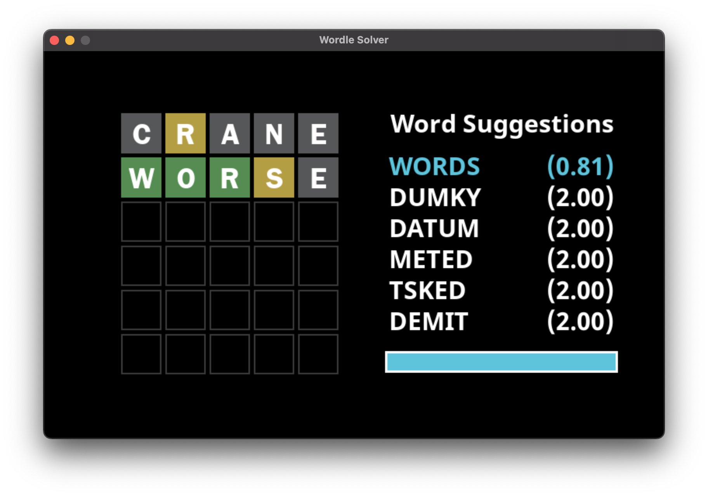
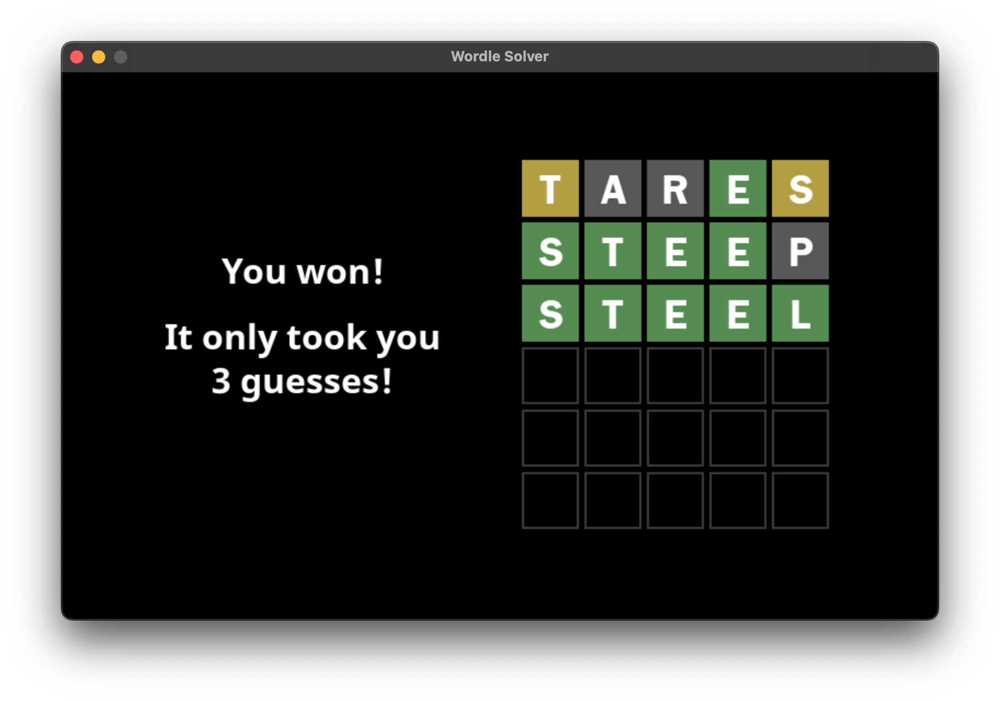
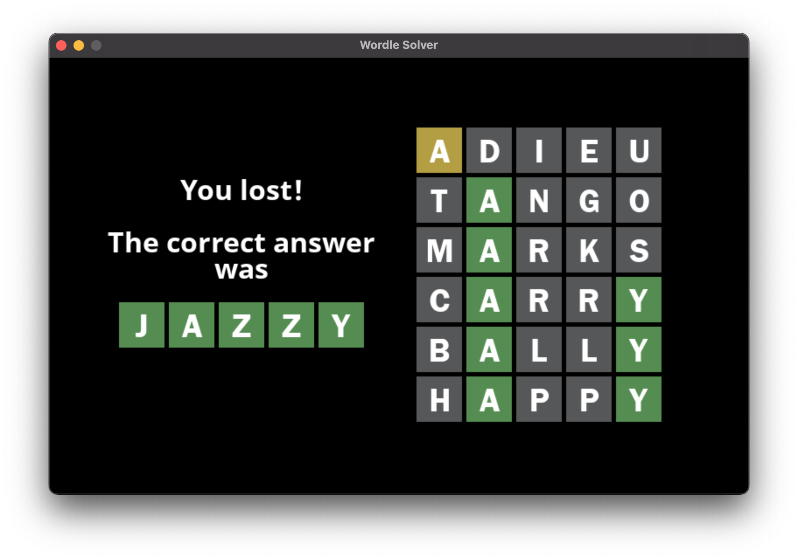
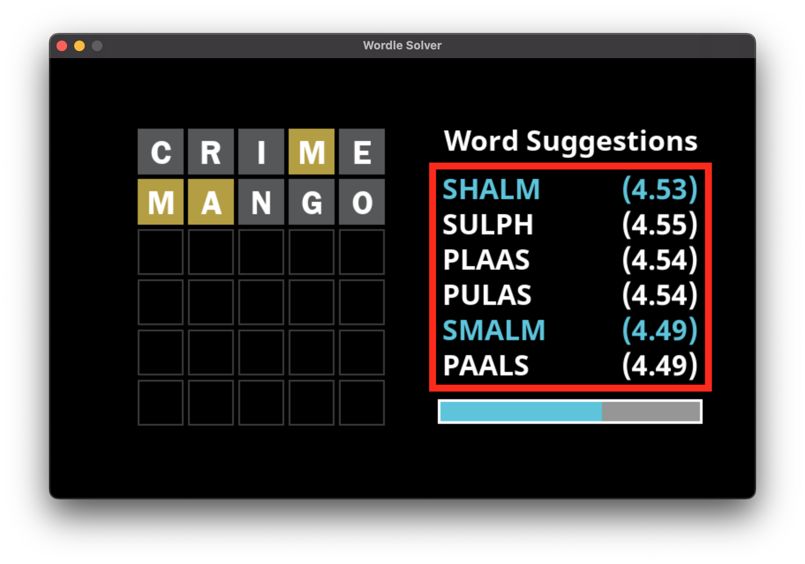
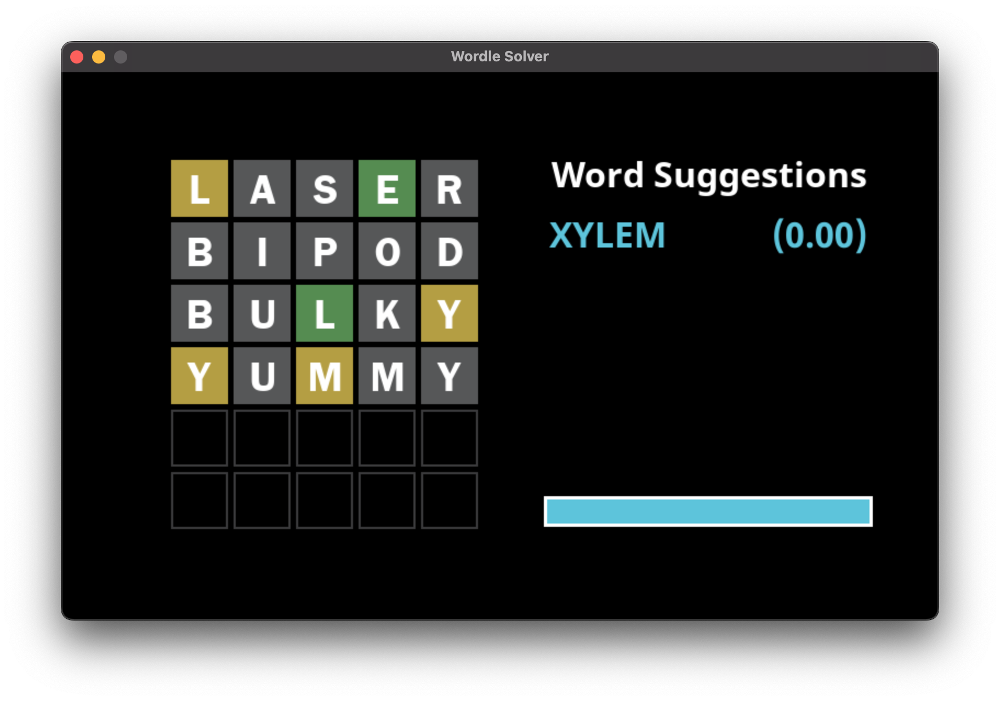
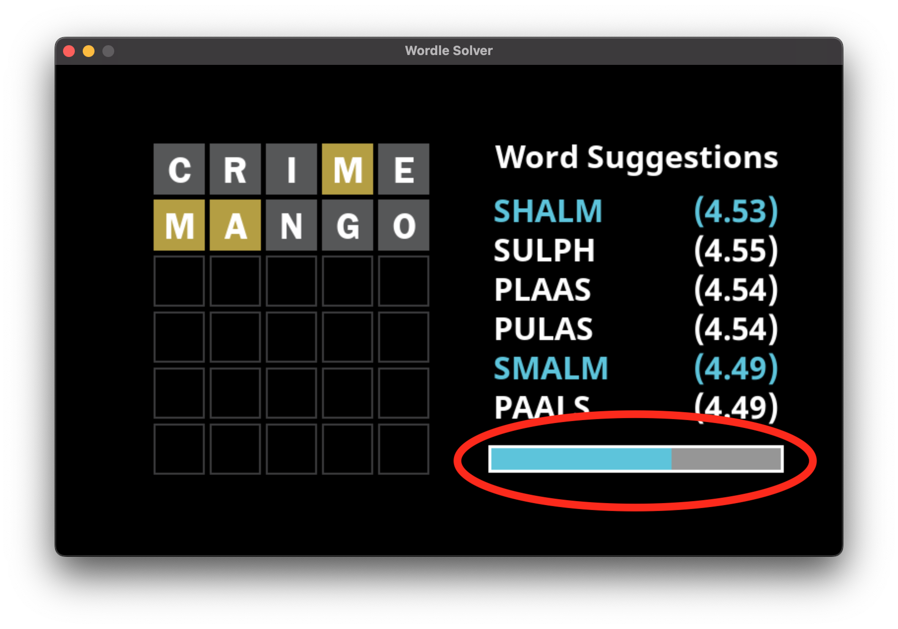

# Wordle Solver

A **Pygame-based Wordle** clone with **information theory-based suggestions** for better-informed guessing.

## Features

### 1. Wordle Game Functionality
Play the classic New York Times Wordle web game offline through a Pygame interface, along with a list of top suggestions for what to guess.


The goal of Wordle is to guess the hidden five-letter word within six guesses. In this clone the answer is chosen from a bank of 14855 words as seen from [this github repository](https://gist.github.com/dracos/dd0668f281e685bad51479e5acaadb93). The list consists of case-insensitive five-letter words made up of English letters. Similarly, the list of five-letter valid guesses is taken from the same dictionary.

In Wordle, you receive feedback for each letter in every guess you make.
Green - The letter is in the correct position of the hidden word
Yellow - The letter exists in the hidden word, but not in the correct position
Gray - The letter does not exist in the hidden word
Each letter is colored from left to right, according to the priority order: green, yellow, then gray.

The game ends when you successfully guess the hidden word correctly, or you run out of guesses. The unofficial goal is typically to guess the answer in as few guesses as possible.




### 2. Information Theory-Driven Word Suggestions
Get top suggestions based on highest expected information gain using [Shannon entropy](https://en.wikipedia.org/wiki/Entropy_(information_theory)).

In this context, it quantifies how much information a particular word is expected to reveal about the hidden word.
It is computed from the distribution of all possible feedback patterns the guess could produce (green/yellow/gray combinations), assuming all remaining candidate answers are equiprobable.
```math
H(g) = -\sum_{r} p(r) \log_2 p(r)
```
where:
* $H(g)$: the expected information gain (in bits)
* $r$: each $3^5 = 243$ possible feedback pattern
* $p(r) = \frac{\text{number of answers that yield pattern r}}{\text{number of remaining candidate answers}}$

A list of highest-entropy guesses is displayed as suggestions for the player. The word and its entropy are shown in either white or blue, with blue words being valid guesses, while white words are invalid. The first word is always the highest-entropy valid word, while the rest are the remaining highest-entropy words. Ties are broken randomly.


When there is only one possible valid guess (the answer), it is instead displayed by itself.


### 3. Parallelized Word Entropy Calculation with Multiprocessing
The application allows the program to run on multiple CPU cores at a time, allowing for optimization of word suggestion speed.

The bottleneck in calculating suggestions is having to calculate the entropy for each word from a potentially large list of candidate answers. To speed up the calculation of word entropies, multiprocessing is utilized to take advantage of remaining computational power. Since each entropy calculation for a given word is an independent subproblem, the task can be parallelized. The process is divided across the number of CPU cores available on the client running the program.

The workload is batched for real-time feedback, allowing the player to keep track of the best guesses calculated so far. The batch size is calculated relative to the number of remaining candidate answers, through this formula:
```math
B = \kappa \cdot \left\lceil \frac{\left| W \right|}{\left| A \right|} \right\rceil
```
where:
* $B$: batch size
* $\kappa$: hand-tuned batching constant
* $W$: set of all words
* $A$: set of all remaining candidate answers

A progress bar is included to indicate the computation progress of word suggestions to the player.


A worker loop is implemented to ensure that each guess's entropy calculation executes independently, preventing race conditions and redundant CPU utilization. A queue manages the task flow so that only one worker processes a task at any given moment. When a new guess is provided, ongoing computations terminate prematurely after completing the current batch.

The application makes use of thread-safe datatypes and synchronization primitives to guarantee data integrity both during execution and at termination of concurrent and parallel computation.

## Setup

### 1. Clone Repository
```bash
git clone https://github.com/ezrazka/wordle-solver.git
cd wordle-solver
```

### 2. Create and Activate a Virtual Environment
For macOS / Linux:
```bash
python -m venv env      # or 'python3' if 'python' is not available
source env/bin/activate
```

For Windows:
```bash
# Windows (PowerShell)
python -m venv env      # or 'python3' if 'python' is not available
.\env\Scripts\Activate.ps1

# Windows (Command Prompt)
python -m venv env      # or 'python3' if 'python' is not available
env\Scripts\activate.bat
```

> **Note:**
> For Windows PowerShell users, when receiving a “running scripts is disabled on this system” error,
> run the following command in PowerShell once:
> ```powershell
> Set-ExecutionPolicy -Scope CurrentUser -ExecutionPolicy RemoteSigned
> ```

### 3. Install Dependencies
```bash
pip install -r requirements.txt      # similarly, use 'pip3' if 'pip' is not available
```

### 4. Run the Application
```bash
python main.py      # or 'python3' if needed
```

### Bonus: `setup.sh` File Example
A `setup.sh` script is included in this repository as an example for automating the environment setup and running the app on macOS / Linux. It may be inspected to review a demonstration of the steps required or used directly if preferred.